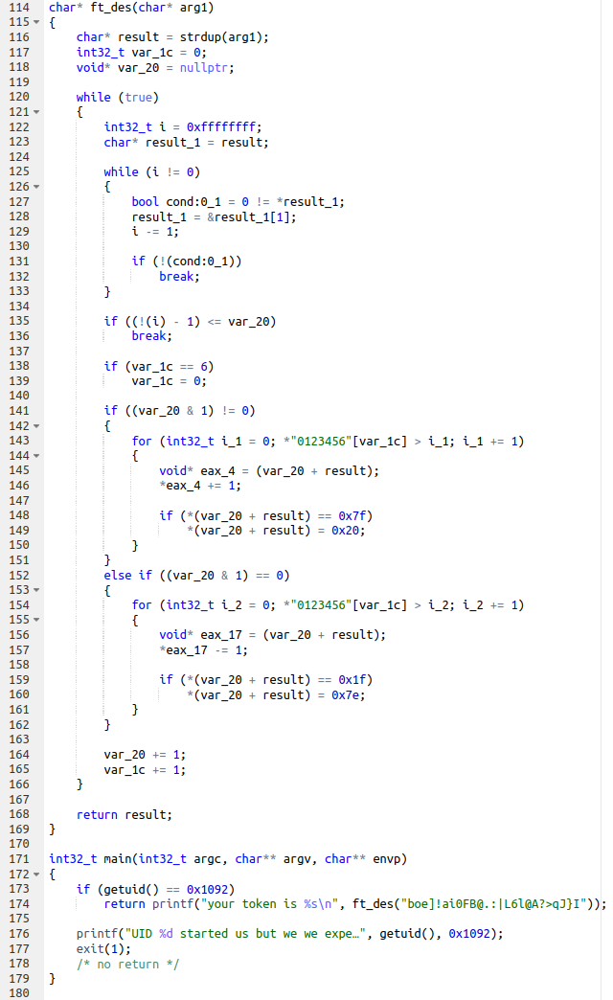
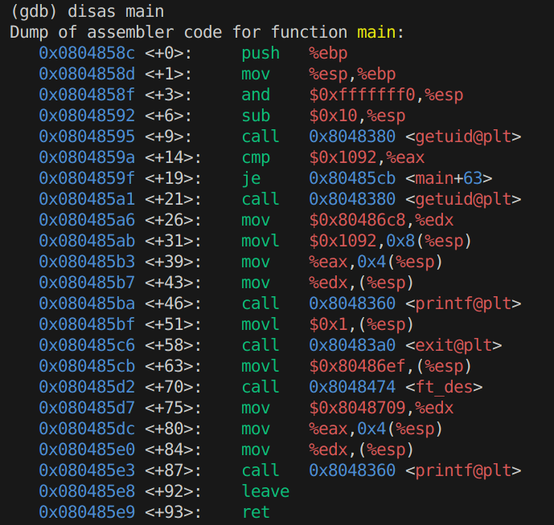
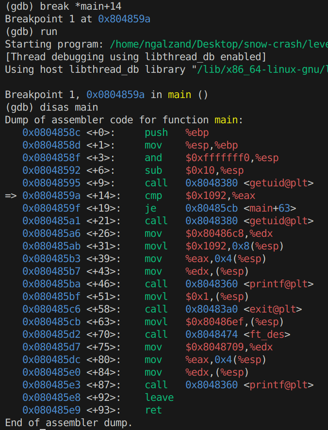

# Level13
On a un binaire `level13` avec la permission **SUID**, appartenant a **flag13**.

Le binaire lit notre **UID** et nous dis que nous ne sommes pas le user attendu. Il attend l'user avec l'uid **4242**.

Or si on regarde `/etc/passwd` on ne trouve aucun user avec l'**UID 4242**. On va donc decompiler le binaire pour chercher une faille potentielle.

Comme on l'attendais il y a un **getuid()**. Si la condition est juste, le token est renvoye. On peut voir sa **version cryptee** en clair, qui est envoye dans une fonction `ft_des` qui le **remet en clair** puis renvoye par **printf()**.

**On a donc 2 options:**

* Tenter de comprendre et recoder la fonction `ft_des` pour decoder le token.
* S'interesser a une nouvelle notion, le **debug**.

On va donc partir a l'aventure avec **GDB**.

**GDB** nous permet de desassembler ce qui nous interesse et de connaitre les addresses de chaque execution.

On localise donc le **getuid()** a +9. Sachant qu'il s'agit d'un appel a une **fonction externe**, on sait que **son retour sera stocke dans le registre %rax**.

La ligne qui suit compare **%eax** (***%rax** sous forme 32-bits*) a **0x1092** (*4242 en hexa*).

*Si seulement on pouvait modifier **%eax** entre les deux instructions 🤔*

Et bien c'est plus facile qu'on pourrait l'imaginer !

Une fois dans **GDB**, on peut executer la commande `break (addr)` pour mettre un breakpoint a l'execution qu'on veux.

Comme par exemple `break *main+14`. De cette maniere, si on fait `run`, le programme va **faire une pause apres l'appel** a **getuid()** et **avant la comparaison**.

Maintenant qu'on est en "pause" a notre instruction, on peut deja commencer par regarder si on peut **acceder** a **%eax**.

Et bien oui, il suffit de faire `print $eax`.

Et notre `uid` sera bien affiche, pour **level13**, c'est **2013**.

Maintenant qu'on a reussi a lire **$eax**, ca serait bien de le modifier non ?

Et bien la non-plus ce n'est pas tres complique, on va utiliser `set`.

Et voila ! Ca devrait fonctionner maintenant non ? Suspense...

Parfait ! Go au dernier level !

**Flag**: `2A31L79asukciNyi8uppkEuSx`

